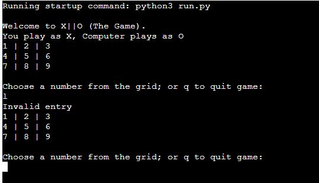

### X||O GAME

The X,O game is a Python terminal game which runs in mock terminal on Heroku. Played on a three-by-three grid by player with a computer who alternately place the marks X and O in one of the nine spaces in the grid.

#### How to play
The player start with choosing number from the grid marking the spaces in a three-by-three grid with X and the computer will mark the O in random. 
The player who succeeds in placing three of their marks in a horizontal, vertical, or diagonal row is the winner.

#### Features
* Existing Feature
    * Game start with the grid and explain to the player to choose number or "q" to quit.

    * The player will start with letter "X", and the computer will choose "O".

* Input valid and error checking
    * You cannot enter any letter or numbers greater than number 9.

    * Result for winner, or loser and if it's tie.

#### Data Model

#### Testing
#### Bugs
#### Validating
* PEP8
    * No errors
    
   

#### Deployment
* This project was deployed using deplpoyment method at Heroku and connected with Github, 
    * Creating a new Heroku app
    * Set the buildbacks to Python and Node Js in the order  as I get fron the template that i got from Love Sandwiches project.
    * Link the Heroku app to repositry
    * Click on manual Deploy.

#### Credits
* Wikipidia details of the game.
